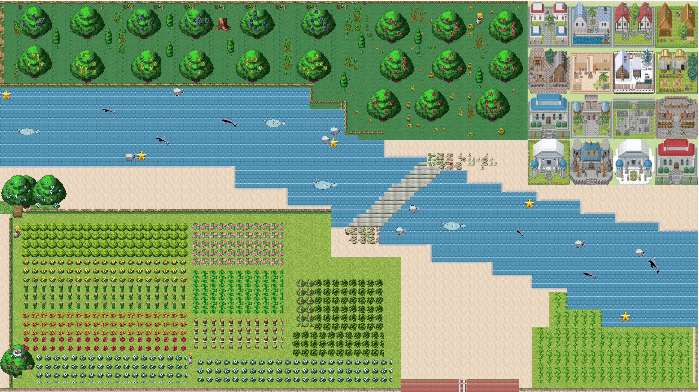

# 项目名称：
逃离村庄
# 版本：
v2.0
# 项目简介：
 小严一觉醒来发现自己身处一个陌生的村庄，周围都是厚厚的围墙，为了逃离村庄，小严必须根据系统提示，一步步完成任务，找到打开村庄大门的钥匙，路上会遇到各种困难，一起来帮助小严逃出神秘村庄吧！

# 阶段任务
## 任务一：完成npc的任务，获得相关线索，找到打开别墅的钥匙
## 任务二：根据线索提示，找到打开地下室的钥匙
## 任务三：根据线索提示，找到打开保险箱中的钥匙。
## 任务四： 与门卫战斗，战斗胜利后打开村庄的大门，逃离神秘村庄。
